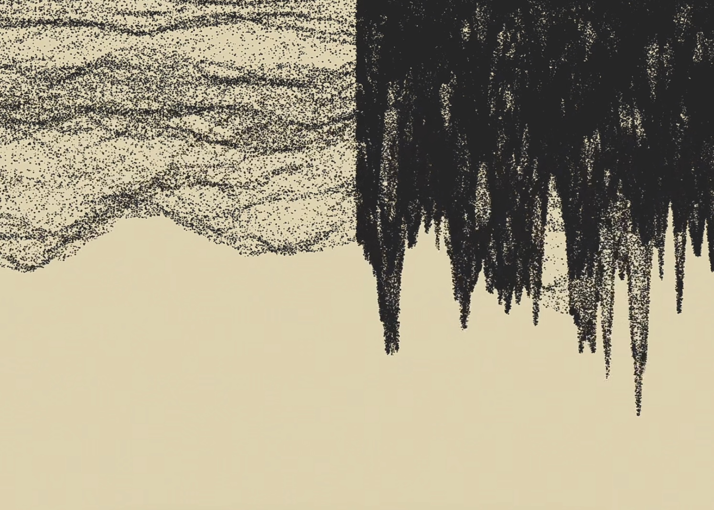
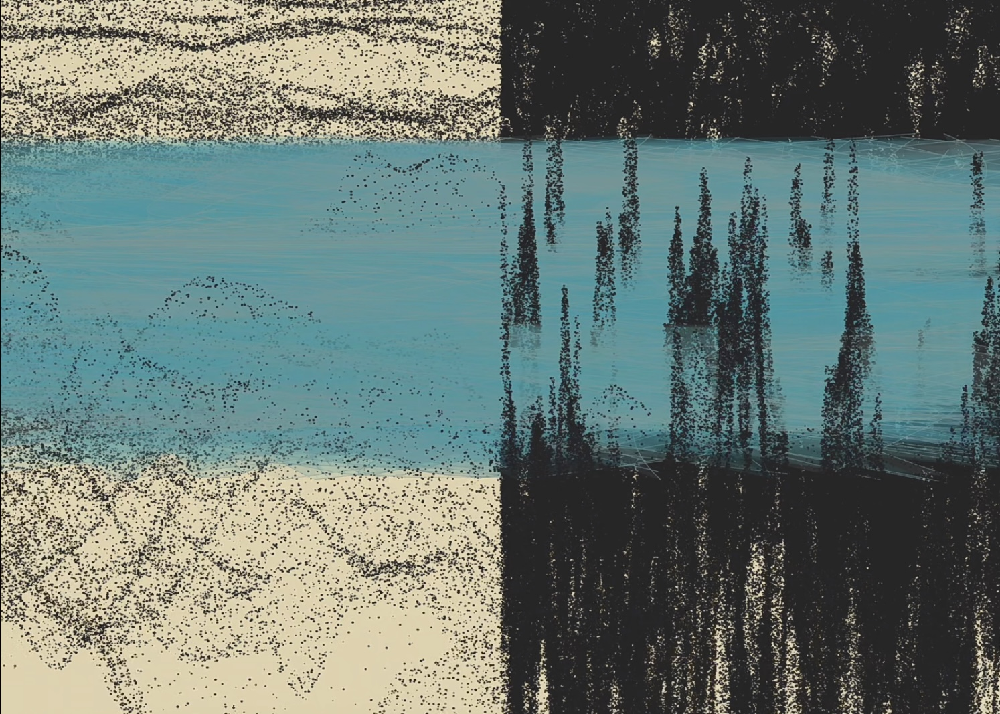
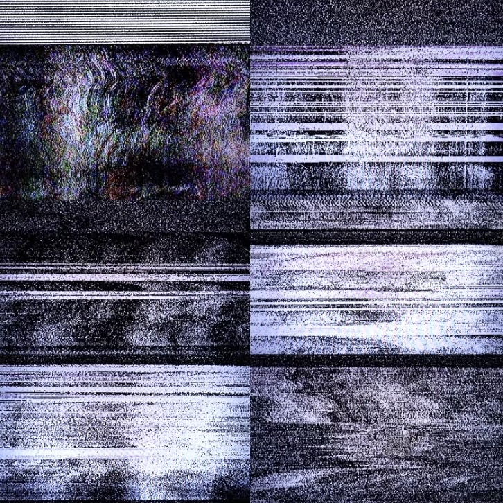

# chku0036_9103_tut5
**Quiz 8 – design research**

**Part 1: Imaging Technique Inspiration**

I was inspired by an artwork full of irregular noise structures. This randomness and order in the work stimulated my interest in noise art. What stands out about noise art is its ability to create textures that feel natural. Although it seems random, it can be controlled by algorithms to create organic and dynamic effects. Through this project, I aim to explore how these patterns can be generated digitally and translated into layered, rhythmic, and interactive visual experiences.

[The video version of these two pictures.](http://xhslink.com/a/gW6Ere0gyI3bb)

**Part 2: Coding Technique Exploration**

I referred to the introduction and example code of the noise() function in the official website of p5.js as the technical basis for this work. By adjusting the input parameters and visual output, I explored how to generate natural textures and dynamic effects with code. This function provides a smoother and more gradual way of change than pure random numbers, which is very suitable for simulating irregular but rhythmic visual performance such as water flow, clouds or terrain.

[The introduction of the code ](https://p5js.org/reference/p5/noise/)